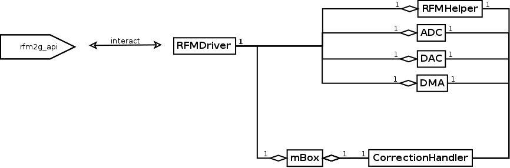

# mBox++

## How to compile and run

Go on the root of the project, create a build folder and go in it:

    cd /path/to/mboxpp/
    mkdir build
    cd build

Then configure the compilation.

In debug mode with the dummy driver:

    cmake -DCMAKE_BUILD_TYPE=Debug -DDUMMY_DRIVER=ON ..

In debug mode with the normal driver:

    cmake -DCMAKE_BUILD_TYPE=Debug ..

In release mode:

    cmake ..

Then build:

    make

Later I'll add a install command to put the executable somewhere in the system with
:

    make install

 

## Class organization

<!-- 
    1st link is for Doxygen
    2nd for gitlab/github/direct markdown
--> 

