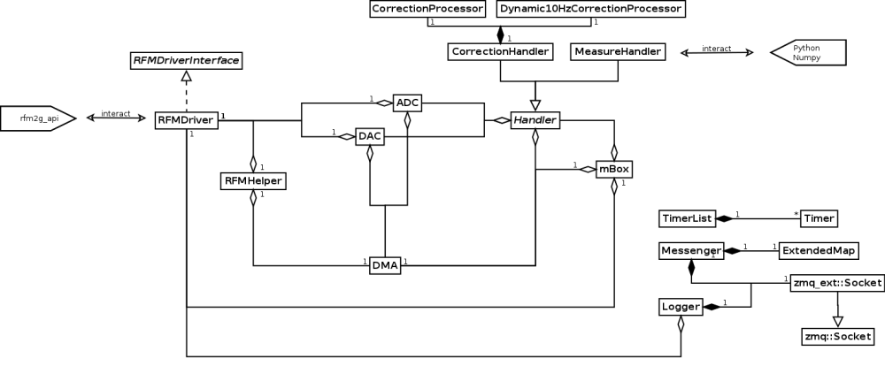

# mBox++

## Contents
 * [How to run](#run-howto)
 * [Dependencies](#deps)
 * [How to compile](#compile-howto)
 * [Class organization](#diagram)

##  How to run

Read only mode (Corrector values are not sent to the RFM):

    mbox --ro

Full mode (read-write):

    mbox --rw

Experiment-mode:

    mbox --experiment <NAME_OF_PYTHON_FILE>

The Python file should contain

##  Dependencies
 * armadillo
 * zeroMQ
 * python (debian: python, libpython, libpython-dev)
 * numpy

##  How to compile

Go on the root of the project, create a build folder and go in it:

    cd /path/to/mboxpp/
    mkdir build
    cd build

Then configure the compilation. If a dependency is missing, you'll be told.

In debug mode with the dummy driver:

    cmake -DCMAKE_BUILD_TYPE=Debug -DDUMMY_DRIVER=ON ..

In debug mode with the normal driver:

    cmake -DCMAKE_BUILD_TYPE=Debug ..

In release mode:

    cmake ..

Then build:

    make

If you want to install (so that it's in the system path):

    make install

To install for the user only (no root needed), add to the cmake command the
following argument (or anything relevant):

    -DCMAKE_INSTALL_PREFIX=$HOME/.local

##  Class organization

<!--
    Width of picture = 1200 px
    1st link is for Doxygen
    2nd for gitlab/github/direct markdown
-->

